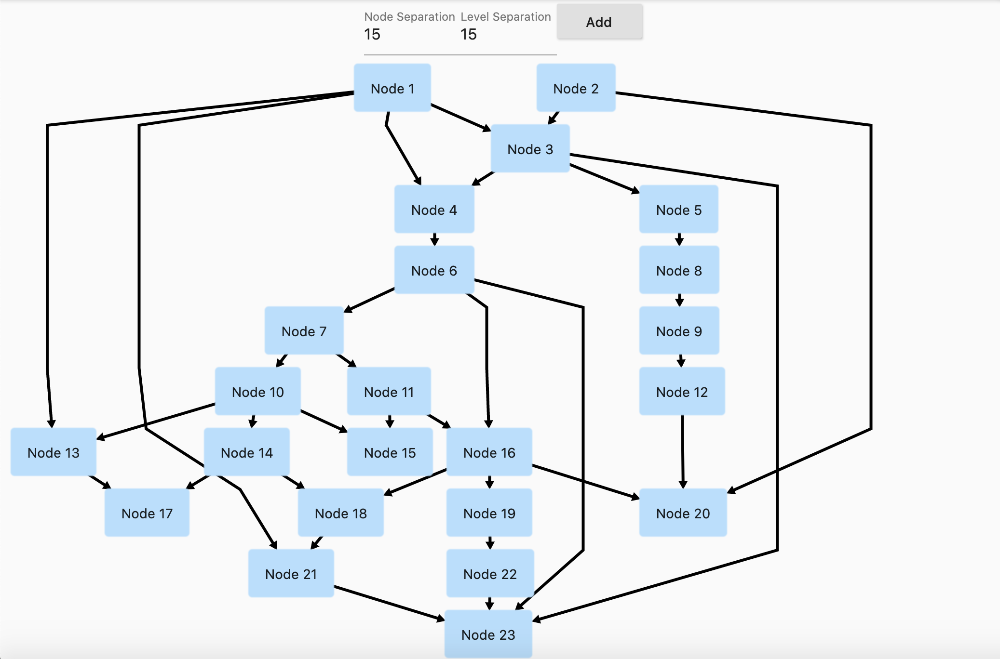
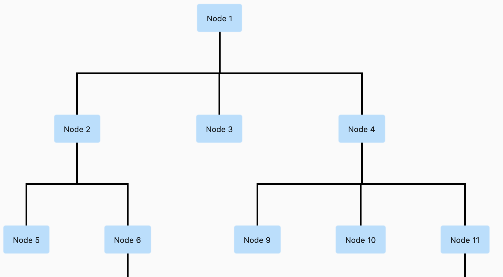
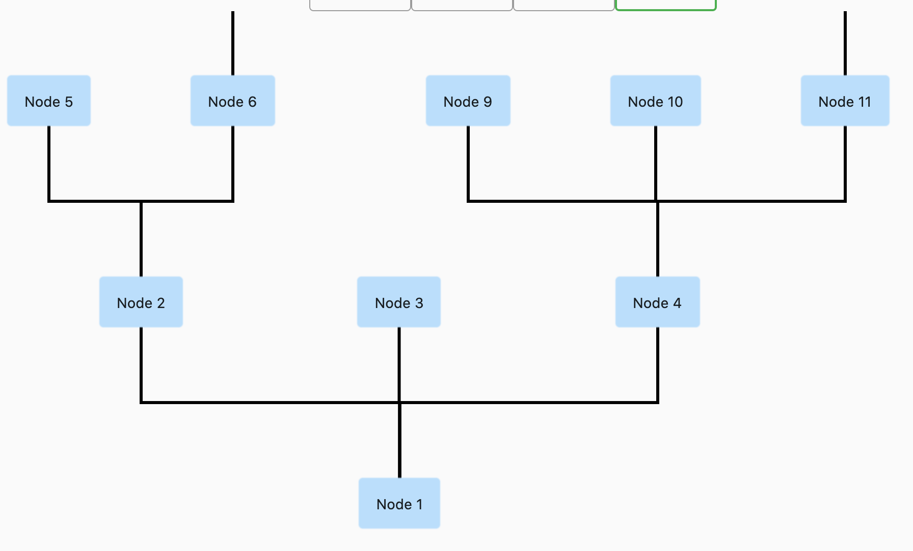
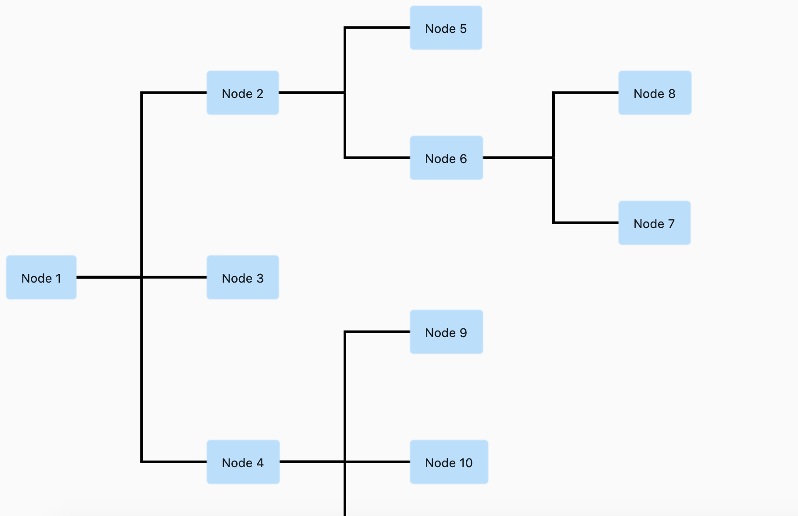
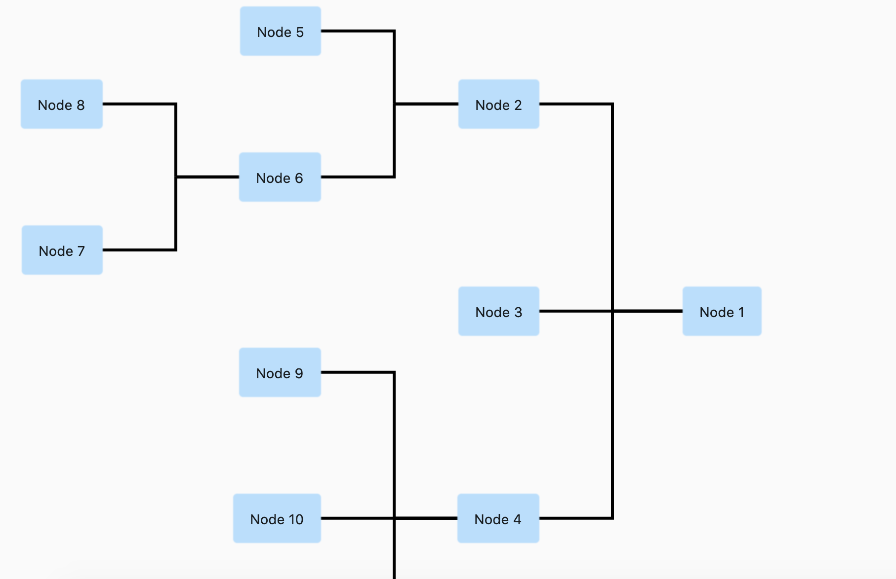
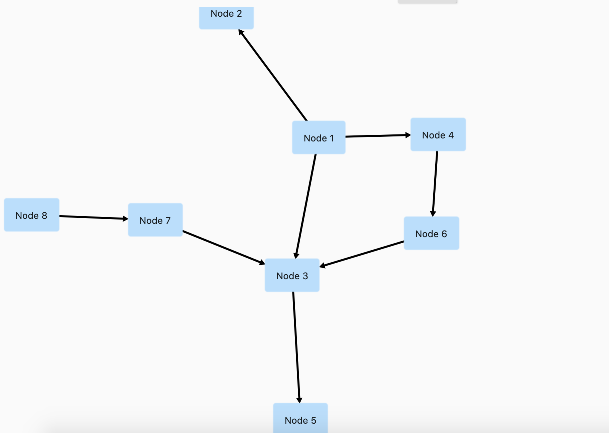

GraphView
===========
Get it from 
[](https://pub.dev/packages/graphview)
[](https://pub.dev/packages/graphview/score) 
[](https://pub.dev/packages/graphview/score)
[](https://pub.dev/packages/graphview/score) |

Flutter GraphView is used to display data in graph structures. It can display Tree layout, Directed and Layered graph. Useful for Family Tree, Hierarchy View.




Overview
========
The library is designed to support different graph layouts and currently works excellent with small graphs.

You can have a look at the flutter web implementation here:
http://graphview.surge.sh/

Layouts
======
### Tree
Uses Walker's algorithm with Buchheim's runtime improvements (`BuchheimWalkerAlgorithm` class). Supports different orientations. All you have to do is using the `BuchheimWalkerConfiguration.orientation` with either `ORIENTATION_LEFT_RIGHT`, `ORIENTATION_RIGHT_LEFT`, `ORIENTATION_TOP_BOTTOM` and
`ORIENTATION_BOTTOM_TOP` (default). Furthermore parameters like sibling-, level-, subtree separation can be set.

Useful for: Family Tree, Hierarchy View, Flutter Widget Tree, 
### Directed graph
Directed graph drawing by simulating attraction/repulsion forces. For this the algorithm by Fruchterman and Reingold (`FruchtermanReingoldAlgorithm` class) was implemented.

Useful for: Social network, Mind Map, Cluster, Graphs, Intercity Road Network,

### Layered graph
Algorithm from Sugiyama et al. for drawing multilayer graphs, taking advantage of the hierarchical structure of the graph (SugiyamaAlgorithm class). You can also set the parameters for node and level separation using the SugiyamaConfiguration. Supports different orientations. All you have to do is using the `SugiyamaConfiguration.orientation` with either `ORIENTATION_LEFT_RIGHT`, `ORIENTATION_RIGHT_LEFT`, `ORIENTATION_TOP_BOTTOM` and `ORIENTATION_BOTTOM_TOP` (default).

Useful for: Hierarchical Graph which it can have weird edges/multiple paths

Usage
======

Currently GraphView must be used together with a Zoom Engine like [InteractiveViewer](https://api.flutter.dev/flutter/widgets/InteractiveViewer-class.html). To change the zoom values just use the different attributes described in the InteractiveViewer class.

To create a graph, we need to instantiate the `Graph` class. Then we need to pass the layout and also optional the edge renderer.

```dart
void main() {
  runApp(MyApp());
}

class MyApp extends StatelessWidget {
  @override
  Widget build(BuildContext context) => MaterialApp(
        home: TreeViewPage(),
      );
}

class TreeViewPage extends StatefulWidget {
  @override
  _TreeViewPageState createState() => _TreeViewPageState();
}

class _TreeViewPageState extends State<TreeViewPage> {
  @override
  Widget build(BuildContext context) {
    return Scaffold(
        body: Column(
      mainAxisSize: MainAxisSize.max,
      children: [
        Wrap(
          children: [
            Container(
              width: 100,
              child: TextFormField(
                initialValue: builder.siblingSeparation.toString(),
                decoration: InputDecoration(labelText: "Sibling Separation"),
                onChanged: (text) {
                  builder.siblingSeparation = int.tryParse(text) ?? 100;
                  this.setState(() {});
                },
              ),
            ),
            Container(
              width: 100,
              child: TextFormField(
                initialValue: builder.levelSeparation.toString(),
                decoration: InputDecoration(labelText: "Level Separation"),
                onChanged: (text) {
                  builder.levelSeparation = int.tryParse(text) ?? 100;
                  this.setState(() {});
                },
              ),
            ),
            Container(
              width: 100,
              child: TextFormField(
                initialValue: builder.subtreeSeparation.toString(),
                decoration: InputDecoration(labelText: "Subtree separation"),
                onChanged: (text) {
                  builder.subtreeSeparation = int.tryParse(text) ?? 100;
                  this.setState(() {});
                },
              ),
            ),
            Container(
              width: 100,
              child: TextFormField(
                initialValue: builder.orientation.toString(),
                decoration: InputDecoration(labelText: "Orientation"),
                onChanged: (text) {
                  builder.orientation = int.tryParse(text) ?? 100;
                  this.setState(() {});
                },
              ),
            ),
            ElevatedButton(
              onPressed: () {
                final node12 = Node.Id(r.nextInt(100));
                var edge = graph.getNodeAtPosition(r.nextInt(graph.nodeCount()));
                print(edge);
                graph.addEdge(edge, node12);
                setState(() {});
              },
              child: Text("Add"),
            )
          ],
        ),
        Expanded(
          child: InteractiveViewer(
              constrained: false,
              boundaryMargin: EdgeInsets.all(100),
              minScale: 0.01,
              maxScale: 5.6,
              child: GraphView(
                graph: graph,
                algorithm: BuchheimWalkerAlgorithm(builder, TreeEdgeRenderer(builder)),
                paint: Paint()
                  ..color = Colors.green
                  ..strokeWidth = 1
                  ..style = PaintingStyle.stroke,
                builder: (Node node) {
                  // I can decide what widget should be shown here based on the id
                  var a = node.key.value as int;
                  return rectangleWidget(a);
                },
              )),
        ),
      ],
    ));
  }

  Random r = Random();

  Widget rectangleWidget(int a) {
    return InkWell(
      onTap: () {
        print('clicked');
      },
      child: Container(
          padding: EdgeInsets.all(16),
          decoration: BoxDecoration(
            borderRadius: BorderRadius.circular(4),
            boxShadow: [
              BoxShadow(color: Colors.blue[100], spreadRadius: 1),
            ],
          ),
          child: Text('Node ${a}')),
    );
  }

  final Graph graph = Graph()..isTree = true;
  BuchheimWalkerConfiguration builder = BuchheimWalkerConfiguration();

  @override
  void initState() {
    final node1 = Node.Id(1);
    final node2 = Node.Id(2);
    final node3 = Node.Id(3);
    final node4 = Node.Id(4);
    final node5 = Node.Id(5);
    final node6 = Node.Id(6);
    final node8 = Node.Id(7);
    final node7 = Node.Id(8);
    final node9 = Node.Id(9);
    final node10 = Node.Id(10);  
    final node11 = Node.Id(11);
    final node12 = Node.Id(12);

    graph.addEdge(node1, node2);
    graph.addEdge(node1, node3, paint: Paint()..color = Colors.red);
    graph.addEdge(node1, node4, paint: Paint()..color = Colors.blue);
    graph.addEdge(node2, node5);
    graph.addEdge(node2, node6);
    graph.addEdge(node6, node7, paint: Paint()..color = Colors.red);
    graph.addEdge(node6, node8, paint: Paint()..color = Colors.red);
    graph.addEdge(node4, node9);
    graph.addEdge(node4, node10, paint: Paint()..color = Colors.black);
    graph.addEdge(node4, node11, paint: Paint()..color = Colors.red);
    graph.addEdge(node11, node12);

    builder
      ..siblingSeparation = (100)
      ..levelSeparation = (150)
      ..subtreeSeparation = (150)
      ..orientation = (BuchheimWalkerConfiguration.ORIENTATION_TOP_BOTTOM);
  }
}
```
### Using builder mechanism to build Nodes
You can use any widget inside the node:

```dart
Node node = Node.Id(fromNodeId) ;

builder: (Node node) {
                  // I can decide what widget should be shown here based on the id
                  var a = node.key.value as int;
                  if(a ==2)
                    return rectangleWidget(a);
                  else 
                    return circleWidget(a);
                },
```

### Using Paint to color and line thickness
You can specify the edge color and thickness by using a custom paint

```dart

getGraphView() {
        return GraphView(
                graph: graph,
                algorithm: SugiyamaAlgorithm(builder),
                paint: Paint()..color = Colors.green..strokeWidth = 1..style = PaintingStyle.stroke,
              );
}
```

### Color Edges individually 
Add an additional parameter paint. Applicable for ArrowEdgeRenderer for now.

```dart
var a = Node();
var b = Node();
 graph.addEdge(a, b, paint: Paint()..color = Colors.red);
```

### Add focused Node
You can focus on a specific node. This will allow scrolling to that node in the future, but for now , using it we can drag a node with realtime updates in force directed graph

```dart
 onPanUpdate: (details) {
        var x = details.globalPosition.dx;
        var y = details.globalPosition.dy;
        setState(() {
          builder.setFocusedNode(graph.getNodeAtPosition(i));
          graph.getNodeAtPosition(i).position = Offset(x,y);
        });
      },
```

### Add drag nodes feature with animation
The code is there but not enabled yet due to dart null safety migration being more important

### Extract info from any json to Graph Object
Now its a bit easy to use Ids to extract info from any json to Graph Object

For example, if the json is like this:
```dart
var json = {
   "nodes": [
     {"id": 1, "label": 'circle'},
     {"id": 2, "label": 'ellipse'},
     {"id": 3, "label": 'database'},
     {"id": 4, "label": 'box'},
     {"id": 5, "label": 'diamond'},
     {"id": 6, "label": 'dot'},
     {"id": 7, "label": 'square'},
     {"id": 8, "label": 'triangle'},
   ],
   "edges": [
     {"from": 1, "to": 2},
     {"from": 2, "to": 3},
     {"from": 2, "to": 4},
     {"from": 2, "to": 5},
     {"from": 5, "to": 6},
     {"from": 5, "to": 7},
     {"from": 6, "to": 8}
   ]
 };
```

Step 1, add the edges by using ids
```dart
  edges.forEach((element) {
      var fromNodeId = element['from'];
      var toNodeId = element['to'];
      graph.addEdge(Node.Id(fromNodeId), Node.Id(toNodeId));
    });
```

Step 2: Then using builder and find the nodeValues from the json using id and then set the value of that.

```dart
 builder: (Node node) {
                  // I can decide what widget should be shown here based on the id
                  var a = node.key.value as int;
                  var nodes = json['nodes'];
                  var nodeValue = nodes.firstWhere((element) => element['id'] == a);
                  return rectangleWidget(nodeValue['label'] as String);
                },
```

### Using any widget inside the Node (Deprecated)
You can use any widget inside the node:

```dart
Node node = Node(getNodeText);

getNodeText() {
    return Container(
        padding: EdgeInsets.all(16),
        decoration: BoxDecoration(
          borderRadius: BorderRadius.circular(4),
          boxShadow: [
            BoxShadow(color: Colors.blue[100], spreadRadius: 1),
          ],
        ),
        child: Text("Node ${n++}"));
  }
```
Examples
========
#### Rooted Tree


#### Rooted Tree (Bottom to Top)


#### Rooted Tree (Left to Right)


#### Rooted Tree (Right to Left)


#### Directed Graph



#### Layered Graph


Inspirations
========
This library is basically a dart representation of the excellent Android Library [GraphView](https://github.com/Team-Blox/GraphView) by Team-Blox

I would like to thank them for open sourcing their code for which reason I was able to port their code to dart and use for flutter.

Future Works
========

- [x] Add nodeOnTap
- [x] Add Layered Graph
- [] Use a builder pattern to draw items on demand.
- [] Animations
- [] Dynamic Node Position update for directed graph


License
=======

MIT License

Copyright (c) 2020 Nabil Mosharraf

Permission is hereby granted, free of charge, to any person obtaining a copy
of this software and associated documentation files (the "Software"), to deal
in the Software without restriction, including without limitation the rights
to use, copy, modify, merge, publish, distribute, sublicense, and/or sell
copies of the Software, and to permit persons to whom the Software is
furnished to do so, subject to the following conditions:

The above copyright notice and this permission notice shall be included in all
copies or substantial portions of the Software.

THE SOFTWARE IS PROVIDED "AS IS", WITHOUT WARRANTY OF ANY KIND, EXPRESS OR
IMPLIED, INCLUDING BUT NOT LIMITED TO THE WARRANTIES OF MERCHANTABILITY,
FITNESS FOR A PARTICULAR PURPOSE AND NONINFRINGEMENT. IN NO EVENT SHALL THE
AUTHORS OR COPYRIGHT HOLDERS BE LIABLE FOR ANY CLAIM, DAMAGES OR OTHER
LIABILITY, WHETHER IN AN ACTION OF CONTRACT, TORT OR OTHERWISE, ARISING FROM,
OUT OF OR IN CONNECTION WITH THE SOFTWARE OR THE USE OR OTHER DEALINGS IN THE
SOFTWARE.